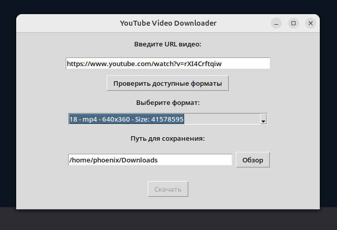
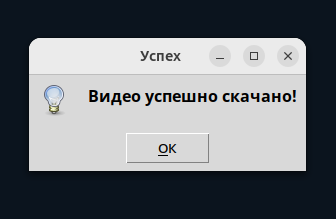

## YouTube Video Downloader

### Использование

1. Установите зависимости:

```bash
  pip install -r requirements.txt
```

2. Запустите скрипт:

в Linux

```bash
  python3 download_yt_dlt.py 
```

в Windows

```bash
  python download_yt_dlt.py
```

3. В поле "Введите URL видео" вставьте URL YouTube видео и нажмите "Проверить доступные форматы".
4. После получения списка доступных форматов, выберите желаемый:



5. Укажите путь для сохранения видео в поле "Путь для сохранения", нажмите "Выбрать папку".
6. После выбора папки, нажмите "Скачать видео". После загрузки видео, оно будет сохранено в выбранной папке и появится
   соответствующее сообщение.

